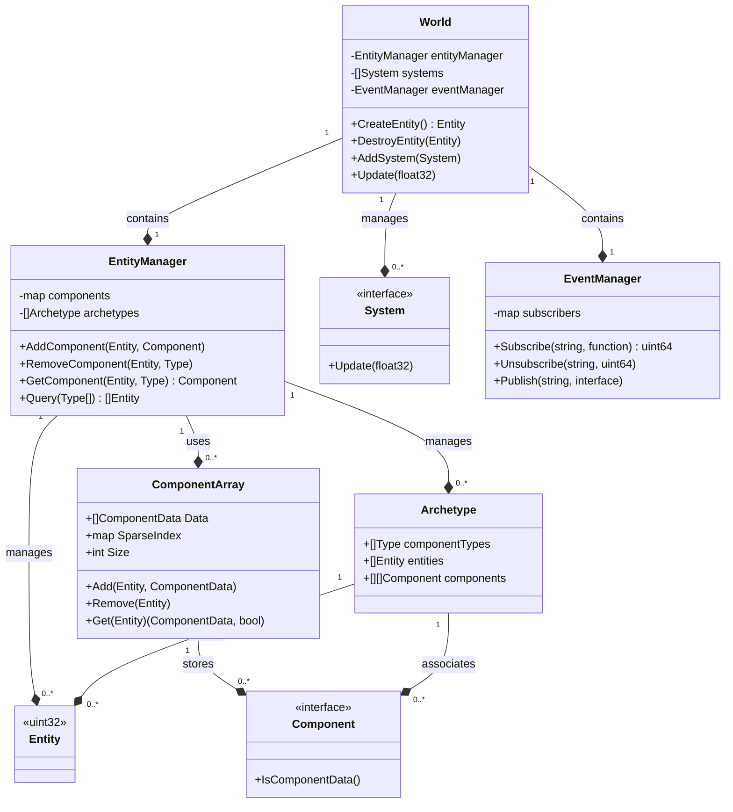

# Strux Architecture

## Table of Contents

1. [Overview](#overview)
2. [Core Components](#core-components)
3. [Data Structures](#data-structures)
4. [System Design](#system-design)
5. [Concurrency Model](#concurrency-model)
6. [Memory Management](#memory-management)
7. [Event System](#event-system)
8. [Performance Considerations](#performance-considerations)
9. [Trade-offs and Design Decisions](#trade-offs-and-design-decisions)
10. [Future Improvements](#future-improvements)

## Overview

Strux is a high-performance Entity Component System (ECS) implemented in Go, designed for building efficient and scalable simulation systems. The architecture follows the classic ECS pattern with optimizations for performance and flexibility. This document provides an in-depth look at the architectural decisions, components, and design patterns used in Strux.

## Core Components

### World

The World is the top-level container in the Strux ECS. It manages the overall simulation state and serves as the primary interface for creating, destroying, and querying entities. The World does not directly manage component data or state.

Key responsibilities:
- Creating and destroying entities
- Managing the lifecycle of entities within the simulation
- Coordinating system execution
- Providing a high-level interface for entity queries
- Updating the overall simulation state

The World delegates the management of component data and state to the EntityManager.

### EntityManager

The EntityManager is responsible for managing the detailed state of entities, including their components. It handles all operations related to component data and state changes within entities.

Key responsibilities:
- Adding and removing components from entities
- Updating component data for entities
- Managing the internal data structures for efficient component storage and retrieval
- Implementing the archetype-based approach for entity-component management
- Providing efficient querying mechanisms for entities based on their component compositions

### Entity

Entities in Strux are represented as simple `uint32` values. This lightweight representation allows for efficient storage and manipulation of large numbers of entities. The World creates and manages these entity identifiers, while the EntityManager associates them with component data.

### Component

Components are pure data structures that can be attached to entities. They implement the `ComponentData` interface, which includes a marker method `IsComponentData()` for type safety. The EntityManager is responsible for managing the lifecycle and state of components attached to entities.

### System

Systems contain the logic that operates on entities with specific component combinations. They implement the `System` interface, which includes an `Update(dt float32)` method. Systems interact with entities and their components through the World and EntityManager interfaces.

### EventManager

The EventManager facilitates decoupled communication between systems and components through a publish-subscribe model.

## Data Structures

### ComponentArray

ComponentArrays store components of the same type in contiguous memory. This design improves cache locality and allows for efficient iteration over components of a specific type.

```go
type ComponentArray struct {
    Data        []components.ComponentData
    SparseIndex map[Entity]int
    Size        int
    sync.RWMutex
}
```

### Archetype

Archetypes group entities with the same component composition, allowing for efficient querying and iteration.

```go
type Archetype struct {
    componentTypes []reflect.Type
    entities       []Entity
    components     [][]Component
}
```

## System Design

Systems in Strux are designed to be modular and focused on specific behaviors. They operate on entities with particular component combinations, promoting a separation of concerns and improving maintainability.

Example system:

```go
type MovementSystem struct{}

func (m *MovementSystem) Update(dt float32) {
    // Implementation of movement logic
}
```

### Interaction between World and EntityManager

The separation of responsibilities between the World and EntityManager is crucial for maintaining a clean architecture:

1. **World's Role**:
   - Provides a high-level interface for entity management
   - Coordinates system execution
   - Delegates component-related operations to the EntityManager

2. **EntityManager's Role**:
   - Manages the internal representation of entity-component relationships
   - Handles all operations related to component data (add, remove, update)
   - Implements efficient querying mechanisms based on component compositions

Example of interaction:

```go
func (w *World) AddComponentToEntity(entity Entity, component Component) {
    // World delegates the component addition to the EntityManager
    w.entityManager.AddComponent(entity, component)
}

func (em *EntityManager) AddComponent(entity Entity, component Component) {
    // EntityManager handles the actual component addition and state management
    // Implementation details...
}
```

This separation allows the World to focus on high-level simulation management while the EntityManager handles the intricacies of component data management and archetype-based optimizations.

## Concurrency Model

Strux uses a mutex-based concurrency model to ensure thread safety:

- Read-write mutexes protect shared data structures
- Systems can be updated concurrently, leveraging multi-core processors
- The World coordinates system execution to prevent data races

## Memory Management

Strux relies on Go's built-in garbage collector for memory management. This decision simplifies the implementation but may introduce some performance variability in large-scale simulations.

Key aspects:
- Component pools are used to reduce allocation overhead
- Contiguous arrays are used for component storage to improve cache locality
- No custom memory allocators are implemented in the current version

## Event System

The event system in Strux allows for decoupled communication between systems and components:

- Publishers can emit events without knowledge of subscribers
- Subscribers can react to events without direct coupling to publishers
- Events are typed and can carry payload data

```go
type EventManager struct {
    subscribers map[string]map[uint64]func(interface{})
    mu          sync.RWMutex
    nextID      uint64
}
```

## Performance Considerations

1. **Data Locality**: Component storage is optimized for cache-friendly access patterns.
2. **Minimal Indirection**: The design minimizes pointer usage to reduce cache misses.
3. **Concurrent System Execution**: Systems can be updated in parallel to leverage multi-core processors.
4. **Efficient Querying**: The archetype-based approach allows for fast querying of entities with specific component combinations.

## Trade-offs and Design Decisions

1. **Component Storage**: Using component arrays improves cache locality but can make removing components slower.
2. **Entity Representation**: Simple uint32 entities are lightweight but lack built-in versioning or recycling.
3. **Component Interface**: The `ComponentData` interface provides type safety at the cost of some runtime overhead.
4. **Archetype-based Entity Management**: Improves query performance but increases memory usage and implementation complexity.
5. **Concurrency Model**: Mutex-based thread safety is simple to implement but may limit scalability in highly concurrent scenarios.
6. **Memory Management**: Relying on Go's garbage collector simplifies the implementation but may introduce GC pauses.
7. **Event System**: Provides flexible communication at the cost of potential overhead and increased complexity.

## Future Improvements

1. **Entity Recycling**: Implement a mechanism to reuse entity IDs for long-running simulations.
2. **Custom Allocators**: Explore custom memory allocation strategies for performance-critical simulations.
3. **Lock-Free Data Structures**: Investigate lock-free alternatives for highly concurrent scenarios.
4. **Component Storage Optimization**: Consider a hybrid approach combining sparse sets and dense arrays.
5. **Code Generation**: Implement tools to generate type-safe, optimized systems and queries.
6. **Profiling and Benchmarking**: Develop comprehensive benchmarks to guide future optimizations.
7. **Serialization**: Enhance save/load capabilities for efficient state persistence.
8. **Documentation and Examples**: Expand documentation and provide more real-world usage examples.

By understanding these architectural decisions and trade-offs, developers can effectively leverage Strux for their simulation and game development needs while being aware of potential areas for customization or optimization based on specific use cases.


